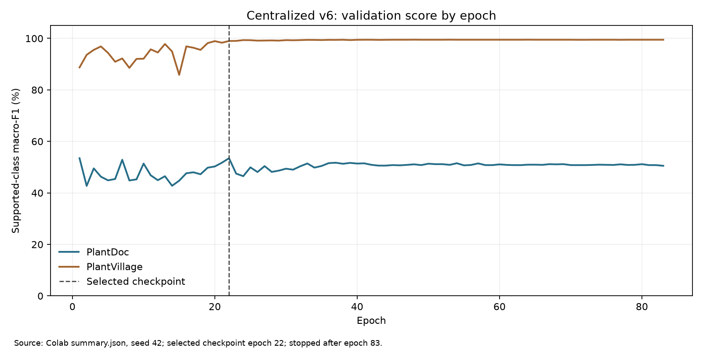

# Train tập trung v6: MobileNetV3-Small trên PlantVillage + PlantDoc

**Phiên bản đã chạy:** Google Colab, seed 42, tập train chung 37.238 ảnh. **Mô hình công bố:** checkpoint tốt nhất epoch 22; lịch sử train có 83 epoch rồi dừng hội tụ sớm trước giới hạn 100. [Kết quả và SHA-256](results/20261003/RESULTS.md) · [Đề xuất cải tiến](docs/DE_XUAT_CAI_TIEN.md).

> Số liệu dưới đây là **validation nội bộ** theo release bất biến. Chưa có đánh giá đủ chuẩn trên ảnh độc lập ngoài Internet. Top-1 trên PlantVillage cao không chứng minh mô hình tốt tương đương khi chụp cả cây ngoài đồng.

## Mô hình tiếp nhận và suy luận ảnh thế nào?

`torchvision.models.mobilenet_v3_small` khởi tạo từ trọng số ImageNet-1K đã kiểm SHA, thay lớp phân loại cuối bằng **38 logit** cho 38 cặp cây–bệnh/khỏe. Toàn mạng được fine-tune từ W0 cố định (`eaf9197b…10850`) để so sánh công bằng với FedAvg và local-only. [Mã mô hình](plant_data_contract/plant_data_contract/models.py) · [bài báo MobileNetV3](https://openaccess.thecvf.com/content_ICCV_2019/papers/Howard_Searching_for_MobileNetV3_ICCV_2019_paper.pdf).

Trọng số khởi tạo: `mobilenet_v3_small-047dcff4.pth` (SHA-256 `047dcff4addef86ea5bc2eff13c9614dc11f47ab1160d0a71a25e7db994f4e1f`) và W0 38 lớp `mobilenet_v3_small_38_seed42_w0.pt` (SHA-256 `52f2ccfd83b4ed21ac44bddb03ec5afd3f119d6f4943f919640b23e39c91c879`). Đây là đầu vào được chốt ngoài nhánh; checkpoint epoch 22 là đầu ra khác W0.

Luồng ảnh cắt vùng lá: mở ảnh và xử lý EXIF → RGB → resize trực tiếp **224×224** bilinear → `ToTensor` về [0,1] → chuẩn hóa ImageNet với mean `(0,485; 0,456; 0,406)`, std `(0,229; 0,224; 0,225)` → backbone trích đặc trưng, gộp thích nghi, lớp 38 đầu ra → chọn nhãn xác suất cao nhất. Train `canonical_v1` thêm lật ngang `p=0,5`; validation dùng phép biến đổi cố định. Khi suy luận với checkpoint này, dùng `canonical_v1`; preset ImageNet của TorchVision (resize cạnh ngắn về 256 rồi cắt giữa 224) **khác** phép resize trực tiếp ở đây. [Mã tiền xử lý](plant_data_contract/plant_data_contract/transforms.py).

Kiến trúc có tầng gộp thích nghi nên về mặt mạng có thể nhận nhiều kích thước tensor, nhưng **code và checkpoint này được huấn luyện/đánh giá tại 224×224**. Resize vuông có thể làm méo tỷ lệ ảnh và mất dấu bệnh nhỏ; ảnh toàn cây nhiều lá không thể được định vị đúng từng lá bởi bộ phân loại một nhãn. Chưa đo ngưỡng chịu được tối thiểu về lux, độ mờ, che khuất hay tỷ lệ lá trong ảnh. [Tài liệu TorchVision về trọng số và đầu vào](https://docs.pytorch.org/vision/stable/models/generated/torchvision.models.mobilenet_v3_small.html).

## Tập dữ liệu và mức trộn

Release chung `dataset/mixed/pv_pd_v3` (SHA-256 `6d2c6b40…43d252`) có 38 lớp. PlantDoc là ảnh cắt vùng lá từ bbox, nới mỗi cạnh thêm **8% chiều rộng hoặc chiều cao bbox** trong giới hạn biên ảnh; PlantVillage là ảnh lá. Train/validation/calibration/legacy diagnostic test được cố định theo manifest và nhóm cảnh `group_id`. Không đưa ảnh hay notebook Colab vào nhánh Git.

| Phần dữ liệu | PlantDoc | PlantVillage | Tổng |
| --- | ---: | ---: | ---: |
| Train | 2.115 | 35.123 | 37.238 |
| Validation | 269 | 4.344 | 4.613 |
| Calibration | 291 | 3.934 | 4.225 |
| Legacy diagnostic test | 172 | 10.843 | 11.015 |

Trong dữ liệu gốc, PlantDoc chiếm **5,68% train**. Sampler `pretrained_pd25` rút khoảng **25% lượt học từ PlantDoc** và 75% từ PlantVillage trong mỗi epoch, lấy có hoàn lại. Điều này lặp một số ảnh, **không làm bộ ảnh gốc thành 25% PlantDoc**. Validation giữ tỷ lệ gốc và không áp dụng sampler. [Sampler](plant_data_contract/plant_data_contract/dataset.py) · [cấu hình](configs/central_spec_v3.json).

## Quy trình huấn luyện

Toàn bộ tập train được gom cho **một optimizer**, khác với FedAvg vốn có nhiều client và tổng hợp trọng số. Cấu hình full: `AdamW`, `lr=0,001`, weight decay `10⁻⁴`, batch `32`, AMP khi có CUDA, tối đa `100` epoch, early-stopping patience cấu hình `12`. Loss là cross entropy. `ReduceLROnPlateau` theo macro-F1 PlantDoc (factor `0,5`, patience `3`) cùng bộ kiểm hội tụ `min_step=15`, `min_delta=0,002`, `lr_patience=4`, `stop_patience=12`. Checkpoint ưu tiên PlantDoc macro-F1 khi PlantVillage vượt ngưỡng bảo vệ; PlantDoc crop accuracy phá hòa. [Mã train](train-tap-trung/scripts/train_production.py) · [quy tắc checkpoint](plant_data_contract/plant_data_contract/quality_control.py).

Mô hình tốt nhất ở **epoch 22**; train vẫn tiếp tục kiểm tra đến **epoch 83** trước khi điều kiện dừng sớm thỏa. Epoch 100 là mức trần, không phải số epoch bắt buộc. `summary.json` chứa lịch sử từng epoch để kiểm đường cong; `checkpoint_best.pt` chứa trạng thái được chọn, không phải epoch cuối.

## Kết quả checkpoint tốt nhất

| Nguồn validation | Top-1 đúng nhãn cây–tình trạng | Macro-F1 lớp có mẫu | Đúng loại cây |
| --- | ---: | ---: | ---: |
| PlantDoc (269 ảnh) | **53,90%** | **53,47%** | **78,81%** |
| PlantVillage (4.344 ảnh) | **99,22%** | **98,99%** | **99,72%** |
| Cả hai (4.613 ảnh) | 96,57% | 96,14% | 98,50% |

Macro-F1 của PlantDoc tính trên **13 lớp có mẫu thật** trong 269 ảnh; PlantVillage có đủ 38 lớp. Hai số macro-F1 vì thế có phạm vi lớp khác nhau.

Trong PlantDoc có **57** ảnh sai loại cây, **67** ảnh đúng cây nhưng sai bệnh; **77** dự đoán sai vẫn có xác suất cao nhất ≥0,9. Kết quả cao ở PlantVillage và thấp ở PlantDoc là dấu hiệu khác biệt miền dữ liệu, chưa đủ để kết luận nguyên nhân của từng ảnh sai. [Metric và lớp nhầm](results/20261003/validation_metrics.json).

### Biểu đồ lịch sử và so sánh



Đường cong trên lấy từ `results/20261003/summary.json`. Các hình sau so sánh **checkpoint tốt nhất** của cả ba kiểu train trên một validation:


## Chạy lại

Cần cung cấp release ảnh, trọng số ImageNet, W0 và incumbent đã chốt từ gói đầu vào. Checkpoint trong `results/` là đầu ra đánh giá. Đặt W0 cùng thư mục với tệp trọng số ImageNet. Ví dụ sau dành cho PowerShell trên Windows: chạy từ gốc nhánh, thay các đường dẫn mẫu bằng đường dẫn thật. Lệnh chỉ kiểm trước train; để train full, bỏ `--preflight-only` và dùng thư mục output mới, rỗng. Trên Colab cần đổi đường dẫn và cú pháp lệnh cho môi trường notebook:

```powershell
$DatasetRoot = 'D:\du-lieu\dataset'
$Weights = 'D:\trong-so\mobilenet_v3_small-047dcff4.pth'
$IncumbentSummary = 'D:\bundle\central_summary.json'
$IncumbentCheckpoint = 'D:\bundle\central_checkpoint_best.pt'
$OutputDir = 'D:\ket-qua\central-run-moi'
python training-workflows/colab_centralized/run.py `
  --dataset-root $DatasetRoot `
  --runner train-tap-trung/scripts/train_production.py `
  --spec-file configs/central_spec_v3.json `
  --pretrained-weights $Weights `
  --incumbent-summary $IncumbentSummary `
  --incumbent-checkpoint $IncumbentCheckpoint `
  --mode full --output-dir $OutputDir --preflight-only --execute
```

Trên Colab có thể thêm `--sync-dir` với đường dẫn thư mục Drive đã gắn để đồng bộ checkpoint. `SOURCE_MANIFEST.json` xác thực mã train, `results/20261003/artifact_manifest.json` xác thực kết quả.
