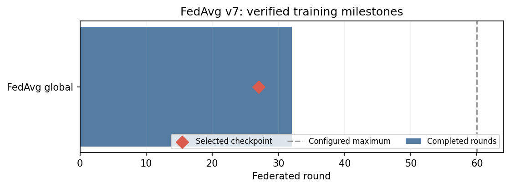
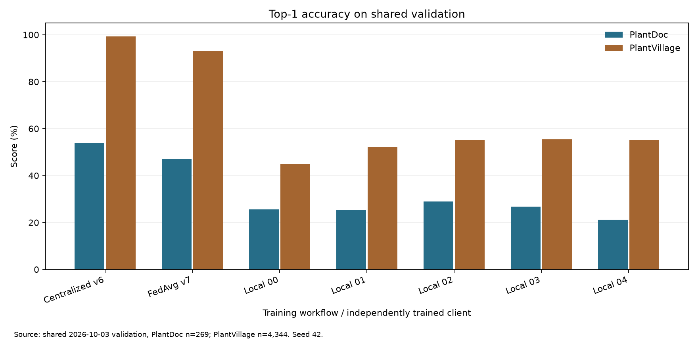
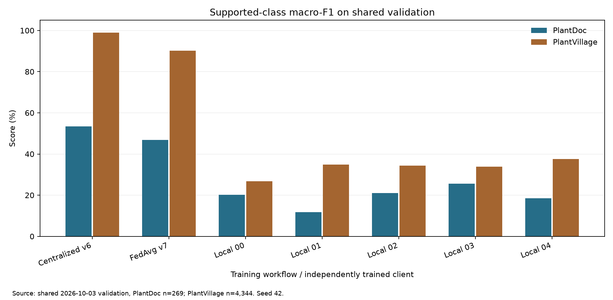

# FedAvg v7: nhận diện cây trồng và bệnh lá trên dữ liệu không đồng nhất

**Phiên bản đã chạy:** Kaggle, seed 42, phân vùng lệch nhãn Dirichlet α = 0,1, năm client. **Mô hình công bố:** checkpoint toàn cục tốt nhất ở vòng 27; phiên chạy kết thúc sớm tại vòng 32/60. [Kết quả và SHA-256](results/20261003/RESULTS.md) · [Đề xuất cải tiến](docs/DE_XUAT_CAI_TIEN.md).

> Các tỷ lệ dưới đây đo trên tập **validation của bộ dữ liệu dự án**. Chưa có phép đo chuẩn hóa trên ảnh độc lập ngoài Internet. Tệp `summary.json` đầy đủ theo từng vòng của Kaggle chưa nằm trong nhánh này; biểu đồ mốc vòng không phải đường cong loss/F1.

## Bài toán và mô hình

Mỗi crop lá được dự đoán thành **một trong 38 nhãn cây × tình trạng bệnh/khỏe**. Bộ phân loại là `torchvision.models.mobilenet_v3_small` với trọng số khởi tạo ImageNet-1K được kiểm SHA-256; lớp tuyến tính cuối thay bằng lớp 38 đầu ra. Toàn mạng được fine-tune từ cùng trạng thái ban đầu W0 (`eaf9197b…10850`) với các thí nghiệm tập trung và local-only. [Mã tạo mô hình](plant_data_contract/plant_data_contract/models.py) · [cấu hình](configs/quality_spec_v4_FEDAVG_FULL.json).

Trọng số gốc dùng tệp `mobilenet_v3_small-047dcff4.pth` (SHA-256 `047dcff4addef86ea5bc2eff13c9614dc11f47ab1160d0a71a25e7db994f4e1f`); W0 38 lớp là `mobilenet_v3_small_38_seed42_w0.pt` (SHA-256 `52f2ccfd83b4ed21ac44bddb03ec5afd3f119d6f4943f919640b23e39c91c879`). Hai tệp này là đầu vào ngoài nhánh và được kiểm trước train.

Luồng nhận diện: đọc ảnh, chỉnh hướng EXIF/chuyển RGB → co ảnh về `224×224` bằng bilinear → `ToTensor` đưa pixel về `[0,1]` → chuẩn hóa `(x−mean)/std` với mean `(0,485; 0,456; 0,406)` và std `(0,229; 0,224; 0,225)` → MobileNetV3-Small trích đặc trưng và gộp không gian → 38 logit → `softmax`/`argmax`. Pipeline `canonical_v1` chỉ thêm lật ngang xác suất 0,5 khi train; validation không tăng cường ngẫu nhiên. [Mã biến đổi](plant_data_contract/plant_data_contract/transforms.py).

Tầng gộp thích nghi của MobileNetV3-Small cho phép nhiều kích thước tensor không gian, nhưng **phiên train này luôn đưa vào 224×224**. Ảnh lớn bị thu nhỏ nên chi tiết bệnh nhỏ có thể mất. Bộ phân loại một nhãn không tự tìm nhiều lá hay xác định lá nào bệnh trên ảnh toàn cây; cần phát hiện/cắt lá rồi suy luận từng lá. Không có ngưỡng độ sáng, độ mờ hoặc tỷ lệ che khuất đã đo cho checkpoint này. [Bài báo kiến trúc](https://openaccess.thecvf.com/content_ICCV_2019/papers/Howard_Searching_for_MobileNetV3_ICCV_2019_paper.pdf) · [TorchVision](https://docs.pytorch.org/vision/stable/models/generated/torchvision.models.mobilenet_v3_small.html).

## Dữ liệu và cách trộn

Một release bất biến `dataset/mixed/pv_pd_v3`, SHA-256 manifest `6d2c6b40…43d252`, dùng chung cho ba kiểu train; ảnh và manifest không nằm trong nhánh Git. PlantDoc dùng crop lá đã tạo từ bbox, nới mép **8%**; PlantVillage là ảnh lá. Tách theo `group_id` để giảm rò rỉ các crop cùng cảnh giữa các phần. [Kiểm tra phân vùng](plant_data_contract/plant_data_contract/partitions.py).

| Phần dữ liệu | PlantDoc | PlantVillage | Tổng |
| --- | ---: | ---: | ---: |
| Train | 2.115 | 35.123 | 37.238 |
| Validation | 269 | 4.344 | 4.613 |
| Calibration | 291 | 3.934 | 4.225 |
| Legacy diagnostic test | 172 | 10.843 | 11.015 |

**Tỷ lệ ảnh gốc PlantDoc trong train là 5,68%**. Sampler đặt xác suất PlantDoc **25% lượt rút trong mỗi local epoch**, PlantVillage khoảng 75%, lấy có hoàn lại (`with_replacement`). Đây là tỷ lệ lượt học, không phải thay đổi số ảnh gốc; cùng ảnh PlantDoc có thể được rút nhiều lần. Trọng số FedAvg vẫn dựa trên **số ảnh gốc riêng biệt `n_k`**, không dựa số lượt rút.

Phân vùng `label_alpha_0_1` chia 37.238 ảnh train thành năm shard theo nhãn, `α=0,1`, seed 42, giữ nhóm cảnh cùng client. Số ảnh từng client: `5.434 / 7.858 / 5.376 / 8.495 / 10.075`; mỗi client chỉ thấy **20–27/38** nhãn. PlantDoc thực tế mỗi shard chiếm **4,34–8,26%** trước sampler. Đây là thí nghiệm **lệch nhãn** đã được audit; không gọi là lệch đặc trưng hay lệch số lượng thuần túy.

## Cách train và tính trọng số

1. Server gửi cùng mô hình toàn cục `w_t` cho cả năm client ở mỗi vòng. Mỗi client tạo optimizer SGD mới, chạy **1 local epoch** trên shard (`batch_size=32`, `lr=0,01`, momentum `0`, weight decay `10⁻⁴`, AMP khi có CUDA).
2. Client trả trọng số sau train. Server đặt `p_k=n_k/Σ_j n_j`, rồi tính **`w_(t+1)=Σ_k p_k·w_(t+1)^k`** cho tham số thực và running statistics. Bộ đếm nguyên BatchNorm được cộng độ tăng so với server thay vì lấy trung bình số nguyên. [Mã tổng hợp và tự kiểm](train-gd-2/kaggle-workspace/campaign-mixed-pv-pd-v1/fedavg_mixed_runner.py).
3. Server đánh giá trên validation chung. Checkpoint ưu tiên macro-F1 PlantDoc **khi** macro-F1 PlantVillage đạt ngưỡng bảo vệ; crop accuracy PlantDoc dùng phá hòa. Hội tụ dùng `min_step=15`, `min_delta=0,002`, `lr_patience=4`, `stop_patience=8`, `lr_factor=0,5`. **60 là giới hạn trên**, không phải cam kết chạy đủ 60 vòng.

Đây là **FedAvg tự triển khai và kiểm số học**, không phải phiên chạy bằng Flower. [Bài báo FedAvg](https://proceedings.mlr.press/v54/mcmahan17a.html) · [tài liệu Flower hiện hành](https://flower.ai/docs/framework/1.36/en/how-to-use-strategies.html).

## Kết quả checkpoint tốt nhất

| Nguồn validation | Top-1 đúng cây và bệnh | Macro-F1 lớp có mẫu | Đúng loại cây |
| --- | ---: | ---: | ---: |
| PlantDoc (269 ảnh) | **47,21%** | **46,87%** | **75,46%** |
| PlantVillage (4.344 ảnh) | **93,12%** | **90,19%** | **98,69%** |
| Cả hai (4.613 ảnh) | 90,44% | 87,17% | 97,33% |

Trong 269 ảnh PlantDoc, mô hình nhận sai loại cây **66** ảnh và đúng cây nhưng sai bệnh **76** ảnh; **41** dự đoán sai vẫn có xác suất cao nhất ≥0,9. Đây là tín hiệu cần kiểm định độ tin cậy, chưa chứng minh nguyên nhân của từng lỗi. [Nhầm lẫn theo lớp](results/20261003/validation_metrics.json).

### Biểu đồ



Biểu đồ này chỉ thể hiện vòng tốt nhất **27**, vòng kết thúc **32** và giới hạn cấu hình **60**. Không có log từng vòng để dựng đường cong train trung thực. Các biểu đồ sau **so sánh checkpoint được chọn** của ba kiểu train trên cùng validation:




## Chạy lại từ nhánh mã

Cần cung cấp release ảnh, manifest phân vùng đã audit, trọng số ImageNet, W0 và incumbent từ bundle gốc; checkpoint trong `results/` là **đầu ra để đánh giá**, không thay W0/incumbent. Chạy `--preflight-only` trước, sau đó bỏ cờ này và dùng output mới:

```powershell
python training-workflows/kaggle_fedavg/run.py `
  --dataset-root <thu-muc-dataset> `
  --runner train-gd-2/kaggle-workspace/campaign-mixed-pv-pd-v1/fedavg_mixed_runner.py `
  --spec-file configs/quality_spec_v4_FEDAVG_FULL.json `
  --pretrained-weights <mobilenet_v3_small-047dcff4.pth> `
  --incumbent-summary <fedavg_summary.json> `
  --incumbent-checkpoint <fedavg_checkpoint_best.pt> `
  --job-id fed_mixed_label_a01_s42 --partition-scheme label_alpha_0_1 `
  --mode full --output-dir <thu-muc-ket-qua-moi> --preflight-only --execute
```

`SOURCE_MANIFEST.json` chốt SHA **mã train**; `results/20261003/artifact_manifest.json` chốt SHA **kết quả**. Không coi validation hoặc legacy diagnostic test là độ chính xác ảnh ngoài mạng.
