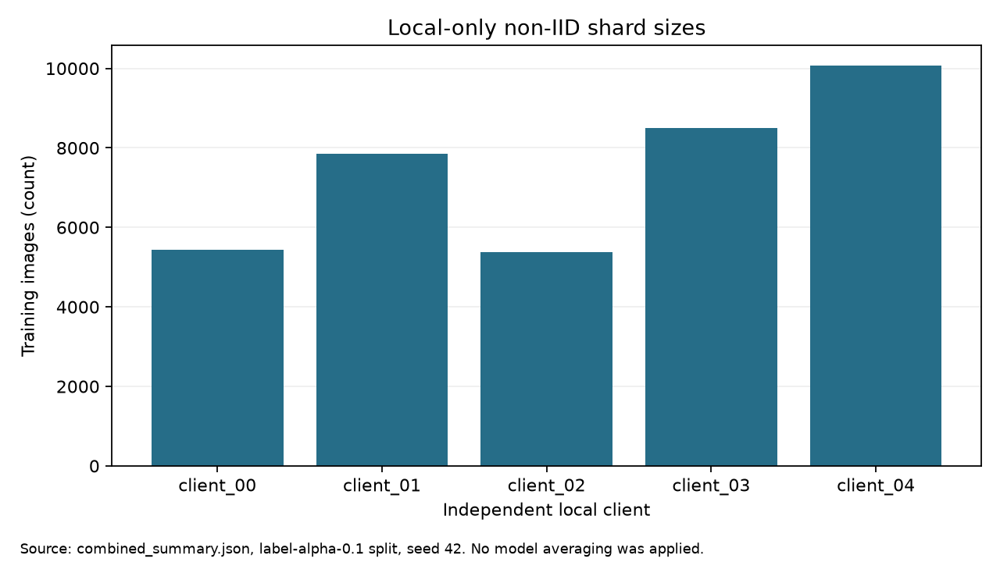

# Local-only: năm mô hình độc lập trên laptop, phân vùng lệch nhãn

**Phiên bản đã chạy:** CUDA trên laptop, seed 42, năm client của `label_alpha_0_1`. Mỗi client train riêng **60 vòng × 1 local epoch** từ cùng W0; **không có server và không tổng hợp trọng số**. [Năm checkpoint và kết quả](results/20261003/RESULTS.md) · [Đề xuất cải tiến](docs/DE_XUAT_CAI_TIEN.md).

> Local-only là **baseline đối chứng** cho FedAvg. Không thể ghép năm độ chính xác thành “độ chính xác của một mô hình local toàn cục”. Kết quả đo trên validation nội bộ, chưa đo chuẩn hóa bằng ảnh độc lập ngoài Internet.

## Mô hình và luồng ảnh

Mỗi client dùng `torchvision.models.mobilenet_v3_small` khởi tạo từ trọng số ImageNet-1K đã kiểm SHA-256, thay lớp cuối bằng **38 logit** cho 38 cặp cây–bệnh hoặc cây–khỏe đã định nghĩa. Cùng W0 (`eaf9197b…10850`) được sao cho từng client. [Mã tạo mô hình](plant_data_contract/plant_data_contract/models.py) · [bài báo MobileNetV3](https://openaccess.thecvf.com/content_ICCV_2019/papers/Howard_Searching_for_MobileNetV3_ICCV_2019_paper.pdf).

Trọng số ImageNet gốc: `mobilenet_v3_small-047dcff4.pth` (SHA-256 `047dcff4addef86ea5bc2eff13c9614dc11f47ab1160d0a71a25e7db994f4e1f`); W0 38 lớp: `mobilenet_v3_small_38_seed42_w0.pt` (SHA-256 `52f2ccfd83b4ed21ac44bddb03ec5afd3f119d6f4943f919640b23e39c91c879`). Đây là đầu vào chung; năm checkpoint trong `results/` là đầu ra riêng từng client.

Ảnh cắt vùng lá được đọc, chỉnh EXIF/RGB, resize trực tiếp **224×224** bilinear, chuyển pixel sang [0,1], chuẩn hóa mean ImageNet `(0,485; 0,456; 0,406)` và std `(0,229; 0,224; 0,225)`. Mạng trích đặc trưng, gộp không gian và dự đoán một trong 38 nhãn. Khi train `canonical_v1` chỉ lật ngang xác suất 0,5; validation cố định. Khi suy luận với checkpoint này, dùng `canonical_v1`; preset ImageNet của TorchVision (resize cạnh ngắn về 256 rồi cắt giữa 224) **khác** phép resize trực tiếp ở đây. [Mã biến đổi](plant_data_contract/plant_data_contract/transforms.py).

Kiến trúc có tầng gộp thích nghi nhưng **phiên chạy sử dụng ảnh 224×224**; ảnh gốc lớn bị thu nhỏ. Bộ phân loại một nhãn không tự phát hiện nhiều lá trên ảnh toàn cây. Độ sáng tối thiểu, mức mờ và phần trăm che khuất tối đa có thể chấp nhận **chưa được đo** cho các checkpoint này. [TorchVision](https://docs.pytorch.org/vision/stable/models/generated/torchvision.models.mobilenet_v3_small.html).

## Dữ liệu, phân vùng và tỷ lệ trộn

Release chung `dataset/mixed/pv_pd_v3` có **37.238 ảnh train**, **4.613 ảnh validation**, 38 nhãn; thêm 4.225 ảnh calibration và 11.015 ảnh legacy diagnostic test. Train gốc: **2.115 PlantDoc (5,68%) + 35.123 PlantVillage**. Validation: **269 PlantDoc + 4.344 PlantVillage**. PlantDoc dùng ảnh cắt vùng lá từ bbox, nới mỗi cạnh thêm 8% chiều rộng hoặc chiều cao bbox trong giới hạn biên ảnh; phép chia giữ nhóm cảnh `group_id`. Release SHA-256: `6d2c6b40…43d252`.

Phân vùng Dirichlet **lệch nhãn α=0,1**, seed 42, bao phủ đủ train và không trùng ảnh/nhóm cảnh giữa client. Mỗi client thiếu nhiều nhãn của bài toán 38 lớp:

| Client | Ảnh gốc `n_k` | Nhãn có trong train | PlantDoc gốc | Checkpoint tốt nhất |
| --- | ---: | ---: | ---: | ---: |
| 00 | 5.434 | 23 | 366 (6,74%) | vòng 32 |
| 01 | 7.858 | 24 | 441 (5,61%) | vòng 37 |
| 02 | 5.376 | 20 | 444 (8,26%) | vòng 43 |
| 03 | 8.495 | 27 | 369 (4,34%) | vòng 11 |
| 04 | 10.075 | 24 | 495 (4,91%) | vòng 46 |

Sampler mỗi client nhắm **25% lượt rút PlantDoc**, khoảng 75% PlantVillage, lấy có hoàn lại. Tỷ lệ này khác với phần trăm ảnh gốc trong bảng; ảnh ít có thể lặp nhiều vòng. Đó là phân vùng **lệch nhãn**, không phải một thí nghiệm lệch số lượng hoặc lệch đặc trưng thuần túy. [Sampler](plant_data_contract/plant_data_contract/dataset.py) · [kiểm partition](plant_data_contract/plant_data_contract/partitions.py).

## Cách train

Với từng client: sao cùng W0 → lấy shard riêng → chạy một epoch SGD (`batch=32`, `lr=0,01`, momentum 0, weight decay `10⁻⁴`, AMP/CUDA) → đánh giá trên validation chung → lưu checkpoint tốt nhất theo **PlantDoc macro-F1 supported** → tiếp tục từ trọng số local hiện tại đến 60 vòng. Optimizer được tạo mới ở mỗi vòng; trọng số model vẫn được giữ xuyên vòng. Không truyền tham số giữa các client. [Launcher](training-workflows/laptop_local_only/launch_local_only.py) · [runner](train-gd-2/kaggle-workspace/campaign-mixed-pv-pd-v1/local_only_mixed_runner.py) · [spec](configs/quality_spec_v4_FEDAVG_FULL.json).

## Kết quả nhận diện

Mỗi cặp số dưới đây là **top-1 đúng nhãn cây–tình trạng / macro-F1 trên lớp có mẫu**, cùng validation 269 PlantDoc và 4.344 PlantVillage cho từng mô hình:

| Mô hình | PlantDoc | PlantVillage | Đúng loại cây PlantDoc |
| --- | ---: | ---: | ---: |
| Client 00 | 25,65% / 20,11% | 44,89% / 26,79% | 59,11% |
| Client 01 | 25,28% / 11,67% | 52,00% / 34,87% | 57,62% |
| Client 02 | **29,00%** / 21,02% | 55,34% / 34,31% | **60,59%** |
| Client 03 | 26,77% / **25,64%** | **55,46%** / 33,93% | 50,19% |
| Client 04 | 21,19% / 18,58% | 55,18% / **37,52%** | 52,42% |

Macro-F1 PlantDoc tính trên **13 lớp có mẫu thật** trong validation PlantDoc; PlantVillage có đủ 38 lớp. Các số macro-F1 giữa hai nguồn không dùng cùng phạm vi lớp.

Các lớp vắng mặt trong shard là giới hạn trực tiếp của mô hình local khi đánh giá đủ 38 lớp. Ví dụ client 02 chỉ có **20** nhãn train. Không so số điểm local với FedAvg như thể cả hai được tiếp xúc cùng nhãn ở một model duy nhất. [Metrics từng client](results/20261003/RESULTS.md).

### Biểu đồ


Hình trên thể hiện **mốc chạy thật**, không phải đường cong loss/F1: summary local-only chỉ giữ checkpoint tốt nhất mỗi client, chưa lưu metric từng vòng. Các hình sau so sánh checkpoint trên validation chung:




## Chạy local-only trên GPU

Cần release ảnh, phân vùng đã kiểm, trọng số ImageNet và W0 từ gói đầu vào. Đặt W0 cùng thư mục với tệp trọng số ImageNet. Chạy từ gốc nhánh, thay các đường dẫn mẫu bằng đường dẫn thật. Lệnh dưới đây kiểm cấu hình **full 60 vòng** mà chưa train; sau khi kiểm đạt, bỏ `--dry-run` và dùng thư mục output mới, rỗng:

```powershell
$env:WORKSPACE_ROOT = (Get-Location).Path
$DatasetRoot = 'D:\du-lieu\dataset'
$Weights = 'D:\trong-so\mobilenet_v3_small-047dcff4.pth'
$OutputDir = 'D:\ket-qua\local-client00-run-moi'
python training-workflows/laptop_local_only/launch_local_only.py `
  --dataset-root $DatasetRoot `
  --spec-file configs/quality_spec_v4_FEDAVG_FULL.json `
  --pretrained-weights $Weights `
  --partition-scheme label_alpha_0_1 --client-id client_00 `
  --output-dir $OutputDir --device cuda --full --dry-run
```

`run_remaining_clients.py` là hàng đợi gắn với workspace ban đầu, chỉ để truy nguyên phiên chạy; không dùng như launcher di động. `SOURCE_MANIFEST.json` chốt SHA mã train, `results/20261003/artifact_manifest.json` chốt SHA các checkpoint/kết quả.
