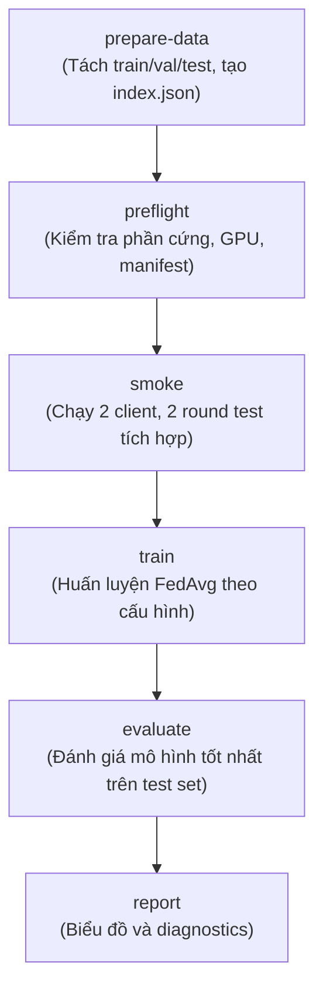

# Hướng dẫn Huấn luyện Federated Learning (FedAvg + MobileNetV3)

Tài liệu hướng dẫn triển khai, vận hành và nghiệm thu hệ thống huấn luyện Federated Learning (FedAvg) trên bộ dữ liệu PlantVillage (38 lớp cây–bệnh) bằng Flower Message API và PyTorch.

---

## 1. Môi trường và Cài đặt

### Yêu cầu hệ thống
- **Hệ điều hành**: Windows 11 64-bit hoặc Linux / WSL2.
- **Python**: Python 3.11 (được khuyến nghị và đã được khóa trong `requirements-train.lock`).
- **Phần cứng**:
  - CPU: Tối thiểu 2 core logic (máy hiện tại có 12 logical CPUs).
  - GPU: Hỗ trợ NVIDIA GPU (CUDA) hoặc CPU fallback tự động. Đã kiểm chứng trên **NVIDIA GeForce RTX 2050 4GB**.
- **PyTorch**: 2.6.0+cu124.
- **Flower & Ray**: Flower 1.36.0, Ray 2.55.1.

### Cài đặt môi trường
Từ thư mục `gd2_federated_learning`:
```bash
# 1. Kích hoạt môi trường ảo (ví dụ với .venv)
.\.venv\Scripts\activate

# 2. Cài đặt package ở chế độ editable
python -m pip install -e . --no-deps
```

Khi tạo venv mới cho GPU, cài wheel CUDA đã kiểm chứng trước, rồi cài lockfile
và editable package (không tự nâng phiên bản):

```powershell
python -m pip install torch==2.6.0+cu124 torchvision==0.21.0+cu124 --index-url https://download.pytorch.org/whl/cu124
python -m pip install -r requirements-train.lock --extra-index-url https://download.pytorch.org/whl/cu124
python -m pip install -e . --no-deps
```

---

## 2. Quy trình Thực thi Chuẩn (Workflow)



### Bước 1: Chuẩn bị dữ liệu và phân hoạch (`prepare-data`)
Lệnh này phân tách tập dữ liệu thành:
- **Test set** (20%, 10.917 ảnh): Giữ nguyên 100% so với `partitions_v3` (SHA-256: `340198e0b2f8945a1f2730b211aacd9ddcbd5b9c46404249771c69a77637e79e`).
- **Global Validation set** (10%, 5.501 ảnh): Dùng chung giữa mọi kịch bản, đầy đủ 38/38 lớp bệnh.
- **Train pool** (37.887 ảnh): Chia theo non-IID Dirichlet cho 10 cơ sở (client).
- Sinh cache SHA-256 nội dung toàn bộ 54.305 ảnh nguồn (`data/source_content_cache.json`).
- Ghi danh mục vào `data/partitions_train_v1/index.json`.

```bash
python -m fl_training.cli prepare-data --config configs/partition_training.yaml
```

### Bước 2: Kiểm định trước huấn luyện (`preflight`)
Kiểm tra tính sẵn sàng của CUDA, Ray, cấu hình YAML, độ toàn vẹn của manifest:

```bash
python -m fl_training.cli preflight --config configs/train_fedavg.yaml
```

### Bước 3: Kiểm tra tích hợp nhanh (`smoke`)
Chạy thử nghiệm mô phỏng Flower 2 client, 2 round với `weights=None`:

```bash
python -m fl_training.cli smoke --config configs/train_smoke.yaml
```

### Bước 4: Huấn luyện chính thức (`train`)
Huấn luyện FedAvg theo cấu hình `configs/train_fedavg.yaml`:

```bash
# Chạy mới
python -m fl_training.cli train --config configs/train_fedavg.yaml

# Khôi phục từ checkpoint gián đoạn (Resume)
python -m fl_training.cli train --config configs/train_fedavg.yaml --resume runs/fedavg/<run_id>/last.pt

# Chạy không hiển thị thanh tiến trình terminal (chế độ non-TTY / CI)
python -m fl_training.cli train --config configs/train_fedavg.yaml --no-progress
```

### Bước 5: Đánh giá mô hình trên tập kiểm thử (`evaluate`)
Đánh giá checkpoint mô hình tốt nhất (`best.pt`) trên tập kiểm thử toàn cục (`global_test.csv`):

```bash
python -m fl_training.cli evaluate --checkpoint runs/fedavg/<run_id>/best.pt

# Checkpoint cũ có absolute path: dùng config mới hoặc override relocation
python -m fl_training.cli evaluate --checkpoint <old>/best.pt --config configs/train_fedavg.yaml

# Tạo lại báo cáo mà không train
python -m fl_training.cli report --run-dir runs/fedavg/<run_id>
```

### Baseline và sweep GĐ2

```bash
python -m fl_training.cli baseline --config configs/train_fedavg.yaml --mode centralized
python -m fl_training.cli baseline --config configs/train_fedavg.yaml --mode local-only

# Mặc định chỉ dry-run, không train
python -m fl_training.cli sweep --config configs/stage2_sweep.yaml

# Chỉ chạy sau khi đã kiểm tra sweep_plan.csv và ngân sách tài nguyên
python -m fl_training.cli sweep --config configs/stage2_sweep.yaml --execute

# Gom lại comparison từ artifacts có sẵn, không train
python -m fl_training.cli sweep --config configs/stage2_sweep.yaml --collect
```

---

## 3. Cấu trúc Thư mục Kết quả (`runs/fedavg/<run_id>/`)

Sau mỗi phiên huấn luyện, thư mục run chứa đầy đủ artifact:
- `resolved_config.yaml`: Toàn bộ cấu hình đã parse và resolve đường dẫn/thiết bị.
- `events.jsonl`: Nhật ký sự kiện có cấu trúc theo chuẩn streaming.
- `client_epochs.jsonl`: loss/accuracy/LR/số mẫu theo client và local epoch.
- `rounds.jsonl`: commit metric theo round; `history.csv` được đồng bộ sau mỗi commit.
- `weights.jsonl`: L2 norm, relative update norm, min/max, non-finite count,
  `n_k`, aggregation weight và tensor bytes; không dump tensor.
- `runtime.log`: Toàn bộ stdout/stderr chi tiết của Flower và Ray worker.
- `history.csv`: Bảng số liệu chi tiết qua từng vòng (round, train_loss, train_acc, val_loss, val_acc, val_macro_f1, lr).
- `last.pt`: Checkpoint commit gần nhất (phục vụ resume an toàn, atomic write).
- `best.pt`: Checkpoint mô hình có validation loss tốt nhất.
- `round_NNNN.pt`: snapshot định kỳ có retention theo config.
- `model_final.pt`: bundle inference của best weights, class mapping và preprocessing.
- `summary.json`: Tóm tắt tổng kết vòng dừng, lý do dừng và hash cấu hình.
- `test_metrics.json`: Kết quả đánh giá trên test set (Top-1 Accuracy, Loss, Macro-F1).
- `confusion_matrix.csv`: Ma trận nhầm lẫn 38x38 lớp.
- `report/`: learning curve, raw/normalized confusion matrix, per-class metrics và
  diagnostics JSON/Markdown.

---

## 4. Xử lý Lỗi và Ghi chú Vận hành

1. **Thanh tiến trình duy nhất**:
   - Tiến trình launcher sở hữu renderer tiến độ duy nhất qua `tqdm` đọc từ `events.jsonl`.
   - Các Ray worker tuyệt đối không in carriage return hoặc spam stdout.
2. **Ngắt bằng Ctrl+C**:
   - Khi nhận SIGINT (Ctrl+C), launcher gửi tín hiệu dừng tới subprocess, bảo toàn nguyên vẹn `last.pt` đã hoàn thành và trả mã thoát `130`.
3. **Cấu hình CUDA / VRAM**:
   - Profile GPU mặc định: 1 GPU/client, Ray actor tuần tự (max_concurrent_clients=1), server evaluation chạy trên CPU để tránh tranh chấp VRAM với Ray actor.
   - Nếu xảy ra OOM trên GPU yếu hơn 4GB, điều chỉnh `batch_size: 8` trong file config trước khi train.
4. **Windows / Ray**:
   - Flower 1.36 vẫn cảnh báo `run_simulation` deprecated và Ray trên Windows là
     experimental. Run có warning được ghi `completed_with_warnings`.
   - Nếu shutdown/access violation lặp lại trước full train, chạy trong WSL2:
     `cd /mnt/d/university/do-an-tot-nghiep/train-gd-2/gd2_federated_learning`
     rồi tạo lại venv từ `requirements-train.lock`.
5. **Sau khi di chuyển thư mục**:
   - Dùng `python -m venv --upgrade .venv` và
     `python -m pip install -e . --no-deps --force-reinstall`.
   - Ưu tiên `python -m pip`; các console launcher cũ có thể chứa absolute path.

## 5. Giới hạn nghiệm thu

Smoke bundle chỉ có 64 ảnh train, 64 ảnh validation và 100 ảnh test không đủ lớp.
Một smoke pass không chứng minh hội tụ, accuracy, robustness hay khoảng cách
Centralized−FedAvg. Kết luận khoa học GĐ2 cần full-data, protocol cố định và
nhiều seed; test set chỉ dùng để báo cáo cuối, không dùng tự chỉnh hyperparameter.
